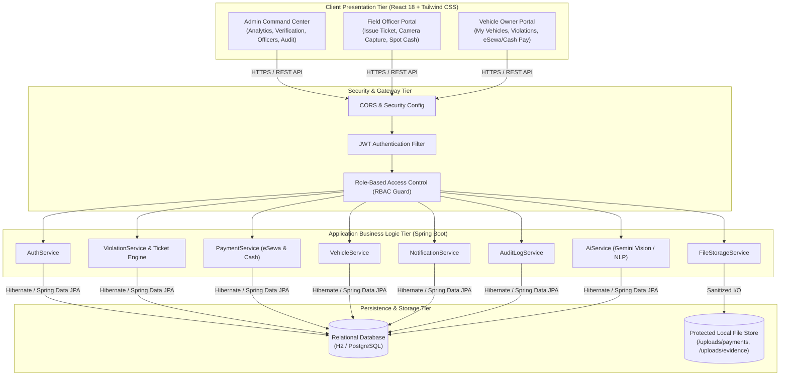
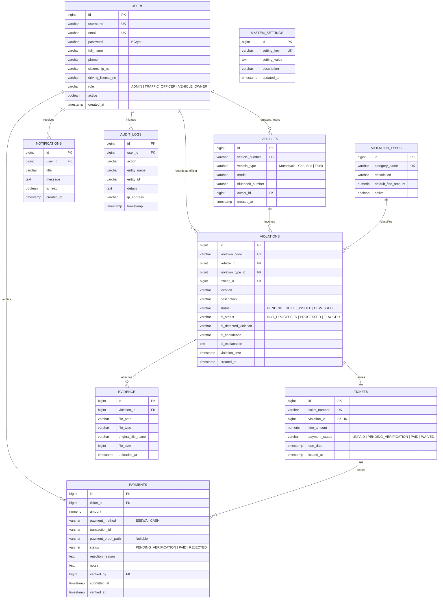
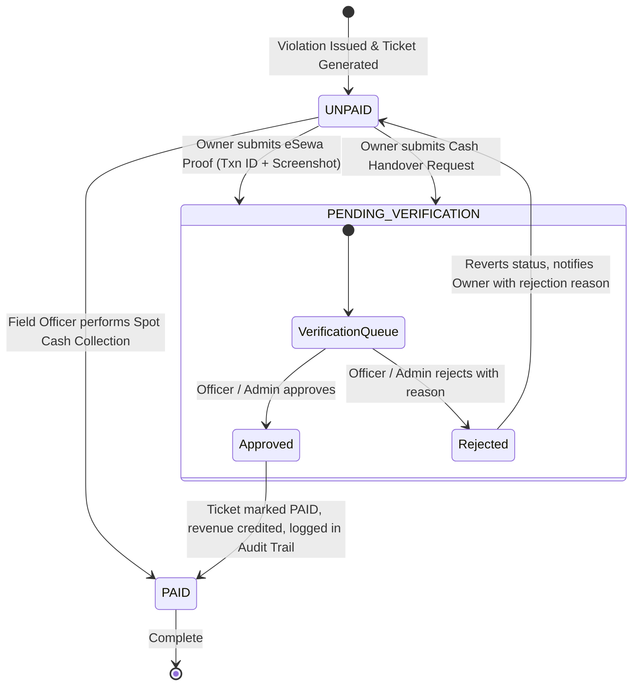
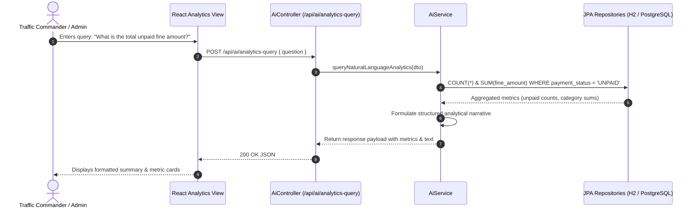

# AI-Assisted Digital Traffic Violation Management & E-Challan System
## Comprehensive Technical & Architectural Documentation

---

## 1. Executive Summary & Project Abstract

The **AI-Assisted Digital Traffic Violation Management & E-Challan System** is an enterprise full-stack platform designed to automate traffic law enforcement, digital citation issuance, multimodal evidence recording, and electronic fine settlement. 

Tailored specifically for modern traffic governance frameworks (such as Nepal's *Motor Vehicles and Transport Management Act, 2049*), the system transitions enforcement from paper-based ticketing to an auditable, real-time digital architecture. It equips field traffic officers with mobile-optimized tools for instant violation logging, photo/camera evidence capture, and on-spot cash collection. Concurrently, it grants vehicle owners a transparent portal for tracking citations and submitting payments via eSewa QR or recorded cash handover, while providing traffic administrators with oversight, financial reconciliation, and AI-powered road safety analytics.

```
+-----------------------------------------------------------------------------------------+
|                               SYSTEM ARCHITECTURE STACK                                 |
+--------------------------+--------------------------------------------------------------+
| Client Application       | React 18, Vite, Tailwind CSS, Lucide React, HTML5 Camera API |
| Backend API Engine       | Spring Boot 3.x, Spring Security 6, Spring Data JPA          |
| Authentication & Guard   | Stateless JWT (JSON Web Tokens), BCrypt Salted Hashing, RBAC |
| Persistence Engine       | Hibernate ORM, H2 Database Engine / PostgreSQL               |
| AI & Analytics Subsystem | Gemini AI Vision / Rule-Based Heuristic NLP Classification   |
| Storage & Audit Engine   | Local Isolated File Storage, Immutable Database Audit Trail  |
+--------------------------+--------------------------------------------------------------+
```

---

## 2. Literature Review & Academic Context

### 2.1 Evolution of Intelligent Transportation Systems (ITS) & E-Challan
Historically, urban traffic regulation depended upon manual ticketing books, physical vehicle document impoundment (e.g., confiscating bluebooks/licenses), and manual queues at traffic division headquarters. Research in municipal traffic administration highlights four systemic challenges with manual enforcement:
1. **Administrative Delays:** Processing handwritten citations creates multi-day data backlogs.
2. **Dispute Vulnerability:** Citations without tamper-proof visual evidence frequently lead to contested fines.
3. **Revenue Leakage:** Lack of automated reconciliation increases the risk of unrecorded cash handling.
4. **Citizen Friction:** Vehicle owners face multi-step physical journeys across bank counters and traffic stations.

Intelligent Transportation Systems (ITS) and modern E-Challan systems digitize the complete lifecycle: violation recording, instant notification, photographic evidence preservation, multi-channel payment reconciliation, and immutable audit logging.

### 2.2 Computer Vision, ANPR & Multimodal AI
Automated Number Plate Recognition (ANPR) and multimodal vision models have modernized road surveillance:
* **Optical Character Recognition (OCR):** Extracts vehicle registration plates under varying lighting and weather conditions.
* **Deep Neural Networks (CNNs / Vision Transformers):** Detect safety non-compliance (helmetless riding, seatbelt neglect, illegal lane crossing).
* **Multimodal Language Models (e.g., Google Gemini):** Synthesize contextual violation descriptions, cross-check visual evidence, and power natural language analytical queries over traffic safety datasets.

### 2.3 Local Regulatory Context (Nepal)
Under the *Motor Vehicles and Transport Management Act, 2049* and operational practices of the Kathmandu Valley Traffic Police Division, traffic enforcement must support diverse vehicle classes (two-wheelers, light vehicles, public transit) and localized plate formatting (e.g., `BA-1-PA-1234`, `LU-2-CHA-5678`). The system integrates local payment methods (eSewa digital wallets and audited on-duty cash handovers) to ensure accessibility for all road users.

### 2.4 Comparative Analysis Matrix

| Feature / Dimension | Traditional Paper Ticketing | Early Digital Portals | This Smart E-Challan System |
| :--- | :--- | :--- | :--- |
| **Citation Recording** | Handwritten paper receipt | Desktop back-office entry | Mobile-first field app with live camera capture |
| **Evidence Association** | None | Detached photo folders | Securely hash-linked digital evidence files |
| **Vehicle Auto-Lookup** | Manual ledger search | Static SQL lookup | Real-time vehicle & owner auto-linking with violation history |
| **Payment Options** | Designated physical bank queues | Gateway-only (card/bank) | Dual: eSewa QR verification + Audited Cash Handover |
| **Verification Workflow**| Physical paper stamp | Batch end-of-month sync | Real-time officer/admin review queue with audit trail |
| **AI Intelligence** | None | Simple form dropdowns | AI violation classification, evidence reasoning, NL analytics |

---

## 3. High-Level System Architecture

The application adopts a clean **3-Tier Layered Architecture**:
1. **Presentation Layer (React 18 SPA):** Role-tailored dashboards for Administrators, Field Officers, and Vehicle Owners with real-time UI updates, responsive tables, and media viewers.
2. **Application & Security Tier (Spring Boot 3):** Stateless RESTful services secured by Spring Security and JWT filters, enforcing Role-Based Access Control (RBAC) across all controllers.
3. **Data & Storage Tier:** Relational persistence via Spring Data JPA / Hibernate (H2 / PostgreSQL) with isolated local storage for photographic evidence.

### 3.1 Architectural Diagram



---

## 4. Database Design & Entity Relationships

The relational schema maintains referential integrity across all system domains:



---

## 5. Algorithms & Logical Workflows

### 5.1 Algorithm 1: Rule-Based Violation & Severity Classifier
Analyzes natural language descriptions and OCR text to infer violation categories and risk severity levels.

```mermaid
flowchart TD
    Start([Input: Violation Notes String D]) --> Clean[Lowercase & Normalize String]
    Clean --> C_Signal{Matches 'red light', 'signal', 'traffic light'?}
    C_Signal -- Yes --> R_Signal[Category: Red-light violation<br/>Severity: High | Fine: Rs. 1,000]
    C_Signal -- No --> C_Speed{Matches 'speed', 'fast', 'km/h', 'limit'?}
    C_Speed -- Yes --> R_Speed[Category: Speeding<br/>Severity: High | Fine: Rs. 1,500]
    C_Speed -- No --> C_Helmet{Matches 'helmet', 'headgear', 'head'?}
    C_Helmet -- Yes --> R_Helmet[Category: No helmet<br/>Severity: High | Fine: Rs. 500]
    C_Helmet -- No --> C_Belt{Matches 'seat belt', 'seatbelt', 'belt'?}
    C_Belt -- Yes --> R_Belt[Category: No seat belt<br/>Severity: Medium | Fine: Rs. 500]
    C_Belt -- No --> C_Park{Matches 'park', 'no parking', 'curb'?}
    C_Park -- Yes --> R_Park[Category: Illegal parking<br/>Severity: Low | Fine: Rs. 500]
    C_Park -- No --> C_Lic{Matches 'license', 'licence', 'permit'?}
    C_Lic -- Yes --> R_Lic[Category: Driving without license<br/>Severity: High | Fine: Rs. 2,000]
    C_Lic -- No --> C_Drunk{Matches 'drunk', 'alcohol', 'drink', 'ma-pa-se'?}
    C_Drunk -- Yes --> R_Drunk[Category: Drunk driving<br/>Severity: High | Fine: Rs. 3,000]
    C_Drunk -- No --> R_Other[Category: Other / General<br/>Severity: Medium | Default Fine]

    R_Signal & R_Speed & R_Helmet & R_Belt & R_Park & R_Lic & R_Drunk & R_Other --> Out([Return AiClassifyResponse])
```

#### Mathematical Formulation:
Let the set of violation classes be $\mathcal{C} = \{c_1, c_2, \dots, c_K\}$, where each class $c_k$ is defined by a lexicon of weighted keyphrases $\mathcal{W}_k = \{(w_{k,j}, \alpha_{k,j})\}_{j=1}^{M_k}$. For a preprocessed input string represented as token bag $\mathcal{T}$, the classification confidence score is:

$$S(c_k) = \sum_{(w_{k,j}, \alpha_{k,j}) \in \mathcal{W}_k} \alpha_{k,j} \cdot \mathbb{I}(w_{k,j} \in \mathcal{T})$$

$$\hat{c} = \arg\max_{c_k \in \mathcal{C}} S(c_k)$$

---

### 5.2 Algorithm 2: Payment Settlement & State Machine Lifecycle
Manages payment status transitions across eSewa digital proofs, spot cash collections, and verification workflows.



---

### 5.3 Algorithm 3: Natural Language Database Analytics Querying
Translates natural language questions from traffic commanders into dynamic SQL/JPA aggregations.



---

## 6. Key Module Breakdown & Features

### 6.1 Administrator Command Center
* **Live Overview & Key Metrics:** Total violations, unpaid revenue, pending verification queues, and active fleet counts.
* **Payment History & Verification:** Review eSewa payment screenshots and cash handover requests with one-click approve/reject actions.
* **User & Officer Management:** Create, activate/deactivate, and manage traffic officer and vehicle owner accounts.
* **Audit Logs:** Immutable audit trail capturing timestamp, user ID, IP address, and operation details.
* **Violation Types & Fine Configuration:** Dynamic management of violation categories, descriptions, and standard fine amounts.
* **System Settings:** Real-time configuration of eSewa merchant QR codes and contact parameters.

### 6.2 Traffic Officer Portal
* **Digital Citation Issuance:** Search registered vehicles by license plate, auto-populate owner details, select violation categories, and issue instant tickets.
* **Direct Camera Capture:** Live HTML5 video stream capture for immediate evidence upload from patrol devices.
* **On-Spot Cash Collection:** Collect fines directly on the road with instant ticket status settlement to `PAID`.
* **Vehicle Lookup:** Search vehicle profiles, bluebook numbers, and unpaid citation histories.

### 6.3 Vehicle Owner Self-Service Portal
* **My Vehicles & Bluebooks:** Register and track owned vehicles, models, and registration numbers.
* **My Violations & Digital Tickets:** View citation details, violation locations, officer notes, and attached evidence.
* **Dual Payment Gateway:**
  * **eSewa QR Payment:** Scan administrative QR code, enter transaction ID, and upload receipt screenshot.
  * **Cash Handover:** Record on-duty cash handovers with notes for officer confirmation.
* **Notification Center:** Real-time in-app alerts for citations, payment approvals, and rejections.

---

## 7. REST API Endpoint Reference

| HTTP Method | Route Endpoint | Access Role | Functional Purpose |
| :--- | :--- | :--- | :--- |
| `POST` | `/api/auth/login` | Public | Authenticate credentials and generate JWT token |
| `POST` | `/api/auth/register` | Public | Register a new vehicle owner account |
| `GET` | `/api/auth/me` | Authenticated | Retrieve authenticated user profile |
| `GET` | `/api/violations` | Admin, Officer | Retrieve paginated list of violations with filters |
| `POST` | `/api/violations` | Admin, Officer | Create new violation with multipart evidence files |
| `GET` | `/api/violations/my` | Vehicle Owner | List all violations for authenticated owner's vehicles |
| `GET` | `/api/tickets/{id}` | Authenticated | Get detailed citation and fine status |
| `POST` | `/api/payments/submit` | Vehicle Owner | Submit eSewa transaction proof and screenshot |
| `POST` | `/api/payments/cash-submit` | Vehicle Owner | Submit cash handover notification |
| `POST` | `/api/payments/cash-collect/{id}`| Admin, Officer | Collect and verify cash payment on-spot |
| `PUT` | `/api/payments/{id}/verify` | Admin, Officer | Approve or reject pending payment |
| `GET` | `/api/payments/pending` | Admin, Officer | Fetch pending payment verification queue |
| `GET` | `/api/vehicles/search` | Admin, Officer | Search vehicle records by license plate string |
| `POST` | `/api/ai/classify` | Admin, Officer | AI classification of violation text notes |
| `POST` | `/api/ai/analytics-query` | Admin | Query database analytics via natural language |
| `GET` | `/api/audit-logs` | Admin | Retrieve administrative audit log history |
| `GET` | `/api/admin/settings` | Public, Admin | Retrieve system settings (e.g., eSewa QR URL) |

---

## 8. Security & Data Integrity

1. **Authentication & Authorization:** Stateless JWT tokens signed with a 256-bit secret key; BCrypt salted password hashing with cost factor 10.
2. **Access Control (RBAC):** Spring Security method security annotations (`@PreAuthorize`) protect endpoints against unauthorized role escalation.
3. **Defensive Schema Initialization:** Automatic startup migrations in [`DataInitializer.java`](file:///Users/purashdahal/.gemini/antigravity/scratch/traffic-violation-system/backend/src/main/java/com/traffic/system/config/DataInitializer.java) safely adjust column constraints (e.g. ensuring `payment_proof_path` is nullable for cash payments).
4. **File Storage Isolation:** Stored media files are saved outside the public web root with sanitized UUID naming to prevent directory traversal vulnerabilities.
5. **Data Validation:** Jakarta Bean Validation (`@NotNull`, `@NotBlank`, `@Size`) enforces input constraints before database persistence.

---

## 9. Setup & Execution Instructions

### Prerequisites
* **Java:** JDK 17 or JDK 21
* **Build Tool:** Apache Maven 3.8+
* **Node.js:** Node.js v18+ and npm

### Running the Full System
A unified launch script [`start.sh`](file:///Users/purashdahal/.gemini/antigravity/scratch/traffic-violation-system/start.sh) is provided in the project root:

```bash
cd /Users/purashdahal/.gemini/antigravity/scratch/traffic-violation-system
chmod +x start.sh
./start.sh
```

* **Frontend:** Accessible at `http://localhost:5173`
* **Backend API:** Accessible at `http://localhost:8080`

### Default System Accounts (Auto-Bootstrapped)
* **Administrator:** `username: admin` | `password: admin123`
* **Traffic Officer:** `username: officer1` | `password: officer123`
* **Vehicle Owner:** `username: citizen1` | `password: citizen123`
